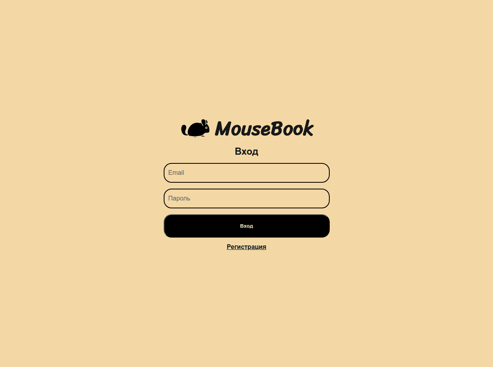
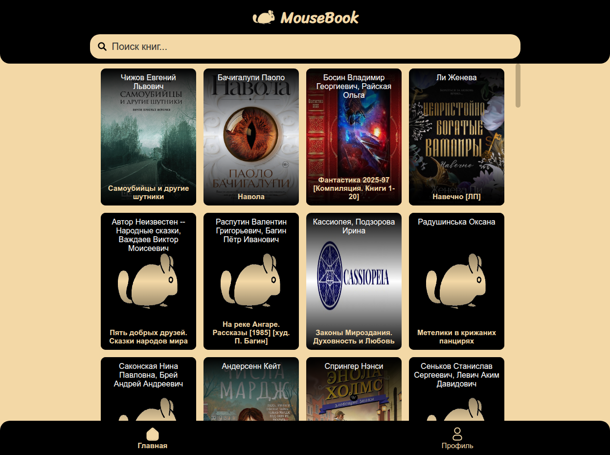
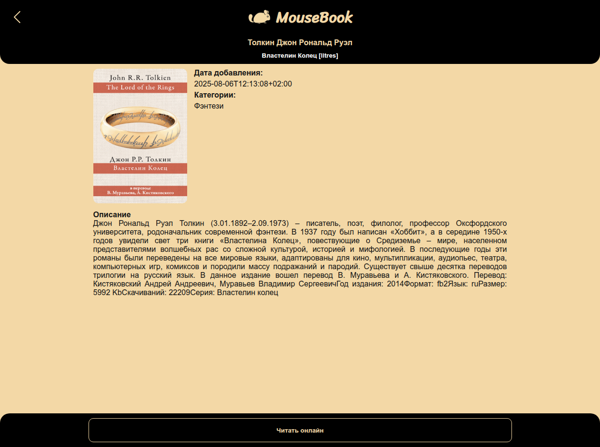

# 📚 Mousebook

> Интерактивное веб-приложение для поиска и чтения онлайн-книг.

## ✨ Демонстрация

🌐 [Посмотреть проект онлайн](https://mousebook.eagle.dev.stack.fvds.ru)

## 📖 Описание проекта

> Данный проект предоставляет пользователям возможность поиска и чтения онлайн книг. Проект был создан для того, чтобы попрактиковаться в работе с Next.js, Node.js, TypeScript, Express, Golang, Go Fiber и Docker.

## 🛠️ Технологии и Стек

| Технология | Описание                                                                         |
| ---------- | -------------------------------------------------------------------------------- |
| Next.js    | Фреймворк на JavaScript, использующий React для построения SSR                   |
| Node.js    | Серверная часть api                                                              |
| Golang     | Серверная часть ауентификации пользователей                                      |
| Go Fiber   | Быстрый серверный фреймворк                                                      |
| Express    | Легкий серверный фреймворк                                                       |
| PostgreSQL | База данных пользователей                                                        |
| Redis      | Хранилище сессий в формате ключ:значение                                         |
| Docker     | Программная платформа для разработки, доставки и запуска контейнерных приложений |

## 📷 Скриншоты

## ✍️ Автор

- [@NikolasEagle](https://github.com/NikolasEagle)
- Telegram: [https://t.me/EglPC](https://t.me/EglPC)